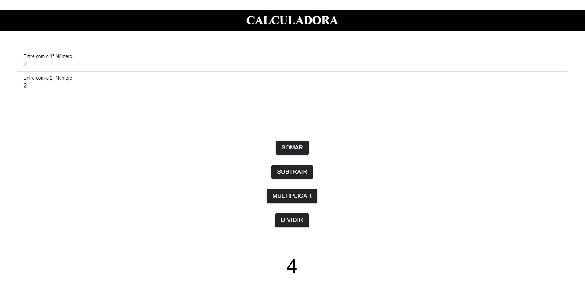

<h1 align="center"> Projeto Calculadora (Angular) </h1>

Projeto em Angular de Calculadora

---

 

  

---
## 💻 Tecnologias

Esse projeto foi desenvolvido com as seguintes tecnologias:

- Angular
- Ferramenta StackBlitz
- HTML5
- CSS3

---

## 🚧 Projeto

Projeto criado em Angular e Typescript pelo curso Técnico Desenvolvimento de Sistemas pela Etec Albert Einstein.
O usuário consegue entrar com 2 Valores e usar as Funções: Somar, Subtrair, Multiplicar e Dividir.
O programa feito está em: src/app/ app.component.ts e app.component.html

Você pode ver o site neste link: [Projeto Calculadora](https://stackblitz.com/edit/ionic6-angular13-tppmvc)

--- 
